<div align="center">👋 Hi, I'm Nikhil

Software Developer • Open Source • Linux • Cybersecurity

<p>
  <a href="https://github.com/nikhilvishwakarma00">
    
  </a>
  <a href="https://github.com/nikhilvishwakarma00">
    
  </a>
</p><p>
  <i>Build things. Break things. Figure out how they work.</i>
</p></div>---

🚀 About Me

I'm a Computer Science student and developer interested in software engineering, open source, Linux, cybersecurity, DevOps, and AI.

I learn primarily by building projects, experimenting with systems, and trying to understand what's happening underneath the abstractions.

«😎 Yes, I use Linux BTW.»

- 💻 Software Development — Building practical applications with a focus on clean UX and performance.
- 📱 Android Development — Kotlin, Jetpack Compose and modern Android architecture.
- 🐧 Linux — Daily-driving Linux and customizing my development environment.
- 🔐 Cybersecurity — Learning ethical hacking, networking, Linux security and penetration testing.
- ☁️ DevOps — Exploring containers, cloud infrastructure, CI/CD and automation.
- 🤖 AI — Exploring LLMs, AI-powered applications and developer tooling.
- 🌱 Currently — Strengthening my fundamentals while building larger projects.

---

🧰 Tech Stack

Languages

<p>
  
</p>Frameworks & Development

<p>
  
</p>Tools & Environment

<p>
  
</p>Exploring

<p>
  
</p>---

🔐 Cybersecurity

<div align="center">«Understand the system. Understand how it breaks. Learn how to secure it.»

</div>I'm building practical cybersecurity knowledge through hands-on labs, CTFs, networking and experimentation.

Areas I'm Exploring

<table>
<tr>
<td>🌐 Web Security</td>
<td>🐧 Linux Security</td>
</tr>
<tr>
<td>🔓 Privilege Escalation</td>
<td>🌐 Networking</td>
</tr>
<tr>
<td>🔑 Cryptography</td>
<td>🧪 Penetration Testing</td>
</tr>
<tr>
<td>🔎 Digital Forensics</td>
<td>🛡️ Defensive Security</td>
</tr>
</table>Tools

<p>
  <code>Nmap</code>
  <code>Burp Suite</code>
  <code>Wireshark</code>
  <code>Metasploit</code>
  <code>SQLMap</code>
  <code>Hydra</code>
</p>Practice

<p>
  <a href="https://tryhackme.com/">
    
  </a>
  <a href="https://www.hackthebox.com/">
    
  </a>
  <a href="https://overthewire.org/">
    
  </a>
</p>---

📱 Featured Project

🎵 Velune

«An ad-free, open-source Android music player.»

Built with:

<p>
  <code>Kotlin</code>
  <code>Jetpack Compose</code>
  <code>Material 3</code>
  <code>Android</code>
</p>Velune started as an experiment in building a clean Android music experience and grew into a real open-source project.

- ⭐ 850+ GitHub stars
- 📥 25,000+ downloads
- 📱 Native Android application
- 🧩 Open source
- 🎨 Focused on clean UI and user experience

<p>
  <a href="https://github.com/nikhilvishwakarma00/Velune">
    
  </a>
</p><blockquote>
  Velune is one of my projects — not the end goal. More ambitious projects are in progress.
</blockquote>---

🧪 What I'm Building

<table>
<tr>
<td align="center" width="20%">💻

<b>Software</b>

</td><td align="center" width="20%">⚙️

<b>Backend</b>

</td><td align="center" width="20%">☁️

<b>DevOps</b>

</td><td align="center" width="20%">🔐

<b>Security</b>

</td><td align="center" width="20%">🤖

<b>AI</b>

</td>
</tr>
</table>I'm working toward larger projects across software engineering, backend systems, DevOps, cybersecurity, AI and developer tooling.

I don't want to just collect technologies.

I want to understand them well enough to build useful things.

---

🖥️ My Setup
```
$ whoami

nikhil — developer, tinkerer & open-source contributor

$ neofetch

OS        → Fedora Linux
WM        → Hyprland
Shell     → Zsh
Editor    → Neovim
Workflow  → Build • Break • Fix • Repeat
```
<p align="center">
  <i>⚡ Minimal setup. Maximum tinkering.</i>
</p>---

🌱 Currently Learning

<table>
<tr>
<td>⚙️ Backend Development</td>
<td>☁️ DevOps & Cloud</td>
</tr>
<tr>
<td>🔐 Cybersecurity</td>
<td>🤖 AI & LLMs</td>
</tr>
<tr>
<td>🧠 Data Structures & Algorithms</td>
<td>🌐 Networking</td>
</tr>
</table>---


---

## 📊 GitHub

<div align="center">

<a href="https://github.com/nikhilvishwakarma00">
  
</a>

<a href="https://github.com/nikhilvishwakarma00">
  
</a>

<br>


</div>

🧠 How I Learn

<div align="center">
       Learn
         →
       Build 
         →
       Break 
         →
       Debug 
         →
     Understand 
         →
      Improve 
         →
       Repeat 

</div>
<br>
<div align="center">
  «I don't want to just know how to use a tool.<br>
  I want to understand why it works.»
</div>

---

📫 Connect With Me

<p>
  <a href="https://github.com/nikhilvishwakarma00">
    
  </a>  <a href="mailto:nikhilvishwakarma9631@gmail.com">
    
  </a>
</p>---

<div align="center">Build it. Break it. Enjoy it, Learn from it. Repeat.👍

</div>
